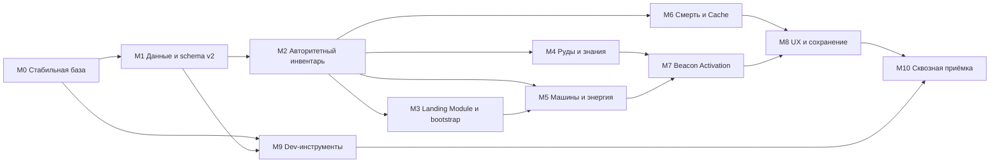

# План работ: фундамент «Восстановления планеты» и gameplay MVP

Статус: подтверждённый план реализации

Дата фиксации: 2026-08-31

Продуктовый словарь: [CONTEXT.md](../../CONTEXT.md)

Архитектурные решения: [ADR 0001](../adr/0001-separate-items-from-world-blocks.md), [ADR 0002](../adr/0002-break-prototype-save-compatibility.md)

## 1. Результат MVP

MVP должен превратить текущий voxel-прототип в одиночную сохраняемую песочницу, в которой игрок:

- прибывает в исправном Landing Module и развивает вокруг него Колонию;
- исследует полностью процедурный мир без гарантированной раскладки контента около старта;
- добывает древесину, биосмолу, железную и медную руду;
- строит блоками свободной формы и устанавливает Functional Blocks;
- собирает Power Network из генератора, кабелей и потребителей;
- переплавляет руду, изготавливает технологические Items и открывает новые рецепты;
- материально расширяет возможности через улучшенный инструмент, переносной запас кислорода и сканирование материалов;
- после смерти возвращает вещи из единственного последнего Recovery Cache;
- находит и активирует один лесной Restoration Beacon;
- получает от активированного маяка энергию, возобновляемые ресурсы и Fast Travel;
- сохраняет мир автоматически или через «Сохранить и выйти» и продолжает его после перезапуска.

Игра не заканчивается после выполнения этой цепочки. Цепочка является внутренним сценарием приёмки, а не заданием, чек-листом или победным условием для игрока.

В MVP **не входит визуальное или симуляционное восстановление Sector**. Beacon Activation создаёт технический фундамент для будущего Planetary Restoration, но не считается самим восстановлением.

## 2. Границы реализации

### Входит в MVP

- одиночная локальная игра с сохранением существующего server/client разделения;
- локальные editor-сборки для Windows и macOS;
- Landing Module, дополнительное свободное строительство и Functional Blocks;
- стабильные `item_id`, отдельные от `block_id`;
- 9 слотов Hotbar и 9 слотов Suit Storage, стаки и масса;
- перегруз, запрещающий спринт и замедляющий ходьбу;
- Handcrafting, Emergency Fabricator и обычный Fabricator;
- Solid-Fuel Generator, кабели и агрегатная модель Power Network;
- Electric Furnace с одним входом, одним выходом и одной выполняемой операцией;
- железо, медь, древесина, биосмола и лечебное волокно;
- Human Technology, Material Analysis и Technology Schematics;
- минимальный набор материального развития: улучшенный инструмент, переносной запас кислорода и сканер/возможность анализа костюма;
- раздельные `personal_knowledge` и `expedition_knowledge` в данных;
- Environmental Threats текущего прототипа: кислород, вода, глубина и падение;
- смерть, возрождение в Landing Module и последний Recovery Cache;
- активация маяка через Beacon Repair Core;
- Beacon Inventory, генерация ресурсов, локальное питание сети и Fast Travel;
- пауза одиночного мира, autosave и «Сохранить и выйти»;
- Source-подобные server/client dev-команды, включая `sv_cheats`, `noclip` и `god`;
- автоматические тесты с единым фиксированным Test World seed.

### Не входит в MVP

- восстановление леса, биома или Sector вокруг маяка;
- финальная постройка и оборона шаттла;
- сюжетный финал или обязательная последовательность целей;
- NPC, колонисты, рабочие и симуляция населения;
- враги, оружие, бой и новые виды угроз;
- XP, уровни и skill tree;
- фактические улучшения костюма, слотов или грузоподъёмности — сохраняется только расширяемая схема данных;
- публичные export-сборки, установщики и релизная инфраструктура;
- реальный сетевой транспорт и поддержка нескольких игроков;
- структурная прочность построек;
- аккумуляторы, солнечная энергия, напряжение, потери, приоритеты потребителей и сложная электросимуляция;
- миграция прототипных сохранений;
- гарантированное размещение руд, руин или маяка около Landing Module в обычном мире;
- интерфейс загрузки Suit Knowledge в Expedition Knowledge.

## 3. Технические принципы

### 3.1. Разделение репозиториев

План затрагивает два контура:

- `[engine]` — корневой репозиторий Flow, прежде всего `modules/voxel_world` и его C++-тесты;
- `[game]` — игровой проект `bin/TestVoxels/asdasd` внутри отдельного репозитория `bin/TestVoxels`.

Корневой `.gitignore` скрывает `bin/`, поэтому проверка только через корневой `git status` недостаточна. Каждая задача должна проверять diff в своём контуре; для игрового проекта обязательна отдельная проверка `git -C bin/TestVoxels diff --check`.

### 3.2. Владение состоянием

- `GameServer` и `GameSession` владеют долговечными игровыми правилами и всеми изменениями мира: инвентарём, рецептами, машинами, энергией, смертью, Cache, маяками и Fast Travel.
- `GameClient`, `survival_player.gd` и HUD передают намерения игрока и отображают подтверждённые события. Клиент не должен самостоятельно создавать предметы или менять персистентное состояние.
- `LocalTransport` остаётся первым транспортом, но команды и события не должны зависеть от того, что сервер и клиент находятся в одном процессе.
- `VoxelWorld` владеет voxel-чанками и персистентными world objects. Состояние Functional Blocks, Recovery Cache и маяков сохраняется как состояние world objects, а не кодируется в `block_id`.
- `GameSaves` владеет индексом миров, совместимостью схемы и метаданными игрока. Номер схемы в GDScript и C++-метаданных мира меняется согласованно.

### 3.3. Идентичность и данные

- `item_id` — стабильный строковый идентификатор инвентарной сущности.
- `block_id` — числовой идентификатор voxel-состояния мира.
- Placeable Item содержит явную ссылку на создаваемый Block или тип world object.
- Рецепты, содержимое контейнеров и знания ссылаются только на `item_id`/`recipe_id`, а не на отображаемые названия.
- Балансовые значения — размеры стаков, масса, длительность, потребление энергии, выход топлива и рецепты — хранятся в каталогах данных, а не размазываются по UI и обработчикам команд.

### 3.4. Детерминизм

- Обычный мир остаётся процедурным и не гарантирует конкретный контент около старта.
- Один `TEST_WORLD_SEED` фиксируется в тестовой fixture и используется C++-тестами генерации, headless smoke и ручной проверкой обеих платформ.
- Смена этого seed считается изменением тестового контракта.
- Разрешение конкурирующих операций Power Network выполняется детерминированно, например по стабильному ID world object, без скрытой зависимости от порядка узлов сцены.

## 4. Порядок работ

М9 можно вести параллельно с gameplay-этапами после М1: ранние команды ускорят тестирование последующих систем.

## 5. Этапы реализации

### М0. Стабилизировать существующий runtime

Цель: получить зелёную и достоверную базу, чтобы новые ошибки не смешивались с известными сбоями прототипа.

Работы:

1. `[game]` Исправить пять текущих падений `runtime_smoke.gd`:
   - не сохранять metadata из локального transform, ещё не принятого сервером;
   - корректно ждать drain грязных чанков;
   - восстановить tick-логирование `update_player_state` на 100-м тике;
   - восстановить режим `log_every_tick`;
   - гарантировать немедленное первое сохранение валидного player state.
2. `[game]` Удалить ложный `BEDROCK_BLOCK_ID := 7` из `game_session.gd` и тестового fake world. Использовать канонический `VoxelWorld.VOXEL_BLOCK_BEDROCK`, равный 9, либо передавать свойство через registry.
3. `[game]` Зафиксировать существующие протокольные инварианты: сервер принимает команды, клиент применяет события, local transport не предоставляет обход авторитетного состояния.
4. `[engine]` Убедиться, что текущие C++-тесты `modules/voxel_world/tests/test_voxel_world_save.h` проходят до расширения формата объектов и генерации.

Критерии приёмки:

- текущий `runtime_smoke.gd` завершается с кодом 0 без ослабления ожиданий;
- wood с ID 7 добывается, а bedrock с ID 9 не добывается;
- сохранение первого валидного состояния и периодический autosave покрыты отдельными ожиданиями;
- изменения игрового проекта и движка проверены раздельно.

### М1. Ввести каталоги данных и breaking save schema v2

Цель: заменить прототипную модель `Dictionary<block_id, count>` расширяемой моделью предметов и заранее определить всё сохраняемое состояние MVP.

Работы:

1. `[game]` Добавить единый Item Catalog со стабильными `item_id` и полями как минимум:
   - отображаемое имя;
   - масса одной единицы;
   - максимальный размер стака;
   - категория;
   - необязательный `places_block_id` или `places_world_object_type`;
   - необязательная ссылка на действие оборудования.
2. `[game]` Добавить Recipe Catalog со стабильными `recipe_id`, входами/выходами по `item_id`, длительностью, требуемой производственной возможностью и способом открытия.
3. `[game]` Зарегистрировать минимальный контент MVP: добываемые материалы, слитки, улучшенный инструмент, переносной запас кислорода, сканер/возможность анализа костюма, кабель, Solid-Fuel Generator, Electric Furnace, Fabricator, Storage, Beacon Repair Core, базовые строительные Items и существующие ресурсы лесного маяка.
4. `[game]` Определить schema v2:
   - Hotbar и Suit Storage как массивы slot records;
   - масса и зарезервированные поля будущих suit upgrades;
   - `personal_knowledge` и `expedition_knowledge` как разные коллекции;
   - Landing Module и fallback spawn;
   - ID последнего Recovery Cache;
   - состояние discovery/fast-travel;
   - world object state машин, контейнеров и маяков.
5. `[game][engine]` Поднять версию схемы одновременно в `game_saves.gd` и C++-слое `VoxelWorld`.
6. `[game]` Показывать старые сохранения как несовместимые в списке миров: их нельзя загрузить, но можно удалить только отдельным явным действием пользователя.
7. `[game]` Не добавлять миграцию v1→v2 и никогда не пересоздавать несовместимый мир поверх существующего каталога.

Критерии приёмки:

- каталог отклоняет повторяющиеся и пустые ID, неизвестные ссылки рецептов и Item→Block ссылки;
- новый мир записывает schema v2 и полностью перечитывается;
- v1 виден как несовместимый и не изменяется после попытки открытия;
- новые сохранённые данные не используют `block_id` как ключ предмета;
- `personal_knowledge` и `expedition_knowledge` присутствуют отдельно даже до появления UI передачи.

### М2. Авторитетный инвентарь, масса и свободная установка

Цель: сделать новую предметную модель рабочей основой добычи, переноски и строительства.

Работы:

1. `[game]` Перенести владение Hotbar и Suit Storage в `GameSession`; удалить клиентские пути, самостоятельно изменяющие количество предметов.
2. `[game]` Реализовать 9 слотов Hotbar и 9 слотов Suit Storage, объединение совместимых стаков, перемещение и выбор активного слота.
3. `[game]` При добыче преобразовывать Block в drops по данным `VoxelBlockRegistry.resource_id`/Item Catalog, а не добавлять сам `block_id`.
4. `[game]` При установке расходовать выбранный Item и создавать указанный Block или Functional Block world object.
5. `[game]` Для подбора соблюдать оба независимых ограничения:
   - если совместимого стака или пустого слота нет, новый Item не подбирается;
   - превышение Carry Capacity не запрещает существующий перенос, но включает перегруз.
6. `[game]` При перегрузе снижать авторитетную скорость движения и отвергать спринт. Клиентское предсказание использует реплицированное состояние перегруза.
7. `[game]` Оставить Basic Tool врождённой возможностью, не Item и не содержимым слота.
8. `[game]` Сохранить Freeform Construction и отсутствие проверки опоры/целостности.

Критерии приёмки:

- один и тот же `item_id` корректно добывается, стакается, переносится, сохраняется и загружается;
- placeable Item создаёт правильный `block_id`, после подтверждения сервера уменьшая стак на один;
- непомещающийся новый Item остаётся в мире/источнике и выдаёт машиночитаемую причину отказа;
- перегруз одинаково влияет на server state и клиентскую презентацию;
- Basic Tool доступен при пустом инвентаре.

### М3. Landing Module и достижимый bootstrap

Цель: обеспечить постоянный старт, возрождение и получение первой независимой производственной цепочки без внешней помощи.

Работы:

1. `[game][engine]` Разместить Landing Module один раз при создании мира в безопасной позиции старта и сохранить его стабильный world object ID/позицию.
2. `[game]` Запретить перемещение или полное разрушение ядра Landing Module; дополнительные Bases при этом никак не ограничивать.
3. `[game]` Реализовать начальное хранилище на 9 слотов.
4. `[game]` Реализовать встроенные Emergency Fabricator и слабый источник энергии, доступные без внешней Power Network.
5. `[game]` Добавить минимальный Handcrafting-набор Human Technology.
6. `[game]` Сформировать recipe graph, из которого достижимы Solid-Fuel Generator, кабели, Electric Furnace и обычный Fabricator.
7. `[game]` Добавить автоматическую проверку графа на циклическую bootstrap-зависимость: игрок не должен нуждаться в выходе машины, которую ещё невозможно построить.

Критерии приёмки:

- новый игрок появляется у одного и того же сохранённого Landing Module;
- после перезагрузки модуль, хранилище и его содержимое не дублируются;
- только из стартовых возможностей и ресурсов мира можно получить первую независимую Power Network и Fabricator;
- уничтожение окружающих блоков не лишает игрока fallback spawn и Basic Tool.

Примечание по балансу: точные количества стартовых ресурсов и стоимость bootstrap-рецептов на этом этапе остаются параметрами данных. Приёмка проверяет достижимость цепочки, а не конкретные числа.

### М4. Железо, медь и открытие рецептов

Цель: добавить материальное исследование мира и оба подтверждённых способа расширения знаний.

Работы:

1. `[engine]` Добавить отдельные Block IDs железной и медной руды, их свойства registry и детерминированные подземные жилы.
2. `[engine]` Генерировать жилы после базового stone pass и до финального сохранения чанка; исключить bedrock, воздух и воду.
3. `[engine]` Покрыть генерацию тестами: одинаковые seed/координаты дают одинаковые жилы, другой seed меняет раскладку, жилы не выходят в запрещённые блоки.
4. `[game]` Настроить drops руд как Items и явное Material Analysis при исследовании нового материала костюмом/сканером.
5. `[game]` Добавить минимум один улучшенный инструмент, ускоряющий подходящую добычу относительно Basic Tool, и один переносной запас кислорода, реально увеличивающий безопасное время исследования.
6. `[game]` Добавить в руины Technology Schematic как конкретную persistent-награду с `recipe_id`.
7. `[game]` Сохранить знания после смерти и перезагрузки; повторный анализ/подбор схемы не создаёт дубликатов.
8. `[game]` Не показывать неизвестные рецепты как обязательный список целей. Интерфейс известного рецепта может указывать способ его открытия после факта открытия.

Критерии приёмки:

- железо и медь воспроизводимо находятся в Test World, но не имеют spawn-гарантий в обычных мирах;
- анализ нового материала открывает его настроенный набор общих рецептов;
- схема из руины открывает ровно один настроенный advanced-рецепт;
- улучшенный инструмент и переносной кислород дают измеримое преимущество без XP, уровней или suit-upgrade UI;
- обе формы знания переживают смерть и save/load;
- world generation не зависит от порядка загрузки чанков.

### М5. Functional Blocks, Power Network и производство

Цель: реализовать основной технологический контур Колонии.

Работы:

1. `[game][engine]` Представлять Functional Block как визуальный Block/world object с устойчивым ID и отдельным state payload.
2. `[game]` Реализовать физическую связность генераторов, кабелей и потребителей по соседним позициям блоков.
3. `[game]` Пересчитывать только затронутую сеть после установки, разрушения или изменения соединения, а не все сети мира каждый tick.
4. `[game]` Реализовать агрегатную модель:
   - генерация и запрошенная мощность;
   - потребитель начинает операцию только при наличии свободной мощности;
   - idle-потребитель не расходует мощность;
   - при исчезновении питания операция ставится на паузу без потери прогресса;
   - возобновление происходит детерминированно и без пользовательских приоритетов.
5. `[game]` Реализовать Solid-Fuel Generator с внутренним слотом топлива: древесина доступна сразу, биосмола имеет большую длительность работы.
6. `[game]` Реализовать Electric Furnace: один вход, один выход, одна текущая операция; переплавка iron/copper ore в refined iron/copper.
7. `[game]` Реализовать обычный Fabricator как powered producer, а Storage — как контейнер без обязательного энергопотребления.
8. `[game]` Сохранять сеть через состояния её world objects, а топологию восстанавливать из позиций после загрузки, не сохраняя хрупкий runtime-граф.
9. `[game]` Защитить контейнеры и машины от дюпа при разрушении, выгрузке чанка и save/load.

Критерии приёмки:

- Generator→Cable→Furnace/Fabricator работает только при физическом соединении;
- древесина и биосмола расходуются с разной настраиваемой эффективностью;
- разрыв кабеля ставит активную операцию на паузу, восстановление продолжает её с прежнего прогресса;
- idle-машины не уменьшают доступную мощность;
- инвентари, топливо и прогресс машин переживают выгрузку чанка и перезапуск;
- разрушение Functional Block выдаёт определённый результат ровно один раз.

### М6. Смерть, возрождение и Recovery Cache

Цель: завершить survival-петлю без возможности безвозвратно заблокировать мир.

Работы:

1. `[game]` Сделать health, oxygen и смертельные последствия авторитетным состоянием GameSession; клиент отображает значения и отправляет только допустимый input/context.
2. `[game]` Обработать достижение нулевого здоровья единым атомарным переходом `alive → dead → respawned`.
3. `[game][engine]` Создавать Recovery Cache world object в месте смерти и переносить в него все переносимые Items.
4. `[game]` Перед созданием нового Cache удалять предыдущий Cache вместе с его содержимым; сохранять только ID нового Cache.
5. `[game]` Не помещать в Cache Basic Tool, Suit Knowledge или Expedition Knowledge.
6. `[game]` Возрождать игрока в Landing Module с валидными health/oxygen и пустыми переносимыми слотами.
7. `[game]` Сохранять переход смерти/Cache немедленно, чтобы аварийный выход не мог продублировать инвентарь.

Критерии приёмки:

- после смерти существует ровно один Cache с точным снимком переносимого инвентаря;
- вторая смерть удаляет первый Cache и его содержимое;
- подбор Cache переносит Items с обычными ограничениями слотов и оставляет непоместившийся остаток внутри;
- знания и Basic Tool сохраняются;
- save/load до и после подбора не создаёт копий предметов.

### М7. Beacon Activation без восстановления Sector

Цель: дать песочнице дальнюю исследовательскую награду и проверить технический фундамент будущего восстановления планеты.

Работы:

1. `[engine]` Изменить существующий emergency/restored-forest beacon template так, чтобы новый маяк создавался dormant, а не `active = true`.
2. `[game]` Добавить один рецепт Beacon Repair Core в обычный Fabricator: refined iron + refined copper + bio-resin; количества остаются балансными данными.
3. `[game]` Реализовать единовременную server-authoritative активацию установкой одного Beacon Repair Core.
4. `[game]` После активации включать:
   - бесплатную генерацию для физически подключённой локальной Power Network;
   - периодическое добавление bio-resin и medicinal fiber во внутренний Beacon Inventory;
   - регистрацию eligible Fast Travel point для первого лесного маяка.
5. `[game]` Не изменять блоки, растительность, biome registry или Sector при активации.
6. `[game]` Разрешить Fast Travel только при взаимодействии с Landing Module или eligible активным маяком. Перемещение бесплатно и переносит текущий инвентарь.
7. `[game]` Проверять безопасную точку прибытия и загружать требуемый регион чанков до разблокировки движения.
8. `[game]` Сохранять activation flag, Beacon Inventory, производственный таймер и список доступных точек.

Критерии приёмки:

- dormant-маяк не производит ресурсы, не даёт питание и не доступен для Fast Travel;
- установка Core расходует ровно один Item и необратимо активирует маяк;
- маяк питает только физически подключённую сеть;
- ресурсы появляются только в Beacon Inventory и не спавнятся в мире;
- Landing Module↔первый лесной маяк работает после активации и после перезагрузки;
- хэш/снимок блоков Sector до и после активации совпадает.

### М8. Игровой UX, пауза и надёжное сохранение

Цель: сделать все MVP-системы понятными без превращения песочницы в управляемый квест.

Работы:

1. `[game]` Добавить единый interaction ray/contract для world objects и контекстный prompt:
   - название цели;
   - доступное действие, например `E — взаимодействовать`;
   - машиночитаемая и человекочитаемая причина недоступности.
2. `[game]` Обновить HUD/панели для:
   - Hotbar и Suit Storage;
   - текущей массы и Carry Capacity;
   - контейнеров;
   - топлива, прогресса и питания машин;
   - Beacon Inventory и Fast Travel;
   - известных рецептов и способа их открытия.
3. `[game]` Не добавлять quest markers, обязательный tutorial chain, список milestone-задач или экран победы.
4. `[game]` Реализовать настоящее pause menu. В одиночной локальной сессии пауза останавливает server ticks, производство, кислород и время мира.
5. `[game]` Реализовать autosave с ограниченным бюджетом чанков и немедленное сохранение критических переходов: смерть, Cache, открытие знания, активация маяка и Fast Travel.
6. `[game]` Реализовать «Сохранить и выйти»: сначала полностью завершить запись metadata/world objects/dirty chunks, затем перейти в меню. При ошибке остаться в мире и показать причину.
7. `[game]` В списке миров явно маркировать несовместимую schema и не предлагать её как загружаемую.

Критерии приёмки:

- каждое взаимодействие имеет понятный success/rejection feedback;
- пауза действительно замораживает авторитетную симуляцию;
- закрытие через «Сохранить и выйти» не теряет завершённые операции и не выходит до успешного flush;
- после reload совпадают инвентари, знания, машины, сети, Cache, маяк, Fast Travel и позиция игрока;
- интерфейс не задаёт игроку обязательный маршрут прохождения.

### М9. Source-подобные dev-команды и диагностика

Цель: сделать воспроизводимую проверку процедурного мира и авторитетных систем возможной без ручного гринда.

Работы:

1. `[game]` Сохранить `DevConsole` парсером/представлением, но маршрутизировать мутации через protocol→GameServer→GameSession.
2. `[game]` Ввести `sv_cheats`, по умолчанию `false`. Cheat-команды отвергаются сервером с кодом `cheats_disabled`, а не только скрываются в UI.
3. `[game]` Реализовать server-команды:
   - `sv_world_info`;
   - `sv_player_info`;
   - `sv_give <item_id> [count]`;
   - `sv_clear_inventory`;
   - `sv_teleport <x> <y> <z>`;
   - `sv_heal`;
   - `sv_set_oxygen <value>`;
   - `sv_set_time <hours>`;
   - `sv_spawn_structure <structure_id>`;
   - `sv_activate_beacon`;
   - `sv_power_info`;
   - `sv_save_now`;
   - `noclip`;
   - `god`.
4. `[game]` Реализовать клиентские команды/ConVars:
   - `cl_position`;
   - `cl_show_chunks`;
   - `cl_show_power`;
   - `cl_show_interactions`;
   - `cl_hide_hud`.
5. `[game]` `noclip` и `god` делать server-authoritative, cheat-gated и неперсистентными. Новый запуск/загрузка мира возвращает их в выключенное состояние.
6. `[game]` Для каждой команды определить строгую arity/type/range-валидацию, usage/help и стабильный результат `{ok, code, message, data}`.
7. `[game]` Не смешивать визуальные client toggles с изменением мира; `cl_*` не должны создавать сетевые gameplay-события.

Критерии приёмки:

- мутационная команда не меняет мир при `sv_cheats = false`;
- при включённых cheats команды проходят тот же авторитетный путь и создают те же события/сохранения, что обычный gameplay;
- неизвестный `item_id`, неверные координаты и неправильное число аргументов дают стабильный error code без частичной мутации;
- `noclip` и `god` доступны в локальной сессии, но сбрасываются при новом запуске;
- client overlays не изменяют server state.

### М10. Сквозная приёмка Windows и macOS

Цель: доказать готовность MVP одним воспроизводимым контрактом, а не набором изолированных демонстраций.

Работы:

1. `[engine]` Поддерживать C++ unit tests для всех изменений voxel-генерации, registry, world objects и формата сохранения.
2. `[game]` Разделить headless GDScript-проверки по доменам, сохранив один агрегирующий entry point.
3. `[game]` Реализовать один детерминированный end-to-end сценарий на `TEST_WORLD_SEED`.
4. `[engine][game]` Запустить один и тот же сценарий на локальных editor-сборках Windows и macOS.
5. `[game]` Провести короткий ручной smoke на обеих платформах для ввода, UI, паузы, консоли и визуальной связности машин.

Автоматический end-to-end сценарий обязан:

1. создать новый Test World и подтвердить Landing Module;
2. добыть/выдать через test harness необходимые материалы без обхода production API;
3. заполнить 18 слотов, проверить отказ подбора и перегруз;
4. построить Generator→Cable→Electric Furnace→Fabricator→Storage;
5. переплавить медь и железо;
6. открыть один рецепт через Material Analysis и один через Technology Schematic;
7. создать и применить улучшенный инструмент и переносной запас кислорода;
8. умереть, создать Cache, возродиться и вернуть его содержимое;
9. изготовить Beacon Repair Core и активировать лесной маяк;
10. проверить питание от маяка, появление обоих ресурсов в Beacon Inventory и Fast Travel;
11. выполнить autosave/«Сохранить и выйти», загрузить мир и сравнить существенное состояние;
12. подтвердить, что Sector не изменился при активации маяка.

Общий критерий готовности:

- C++ unit tests зелёные;
- все headless GDScript smoke-тесты зелёные;
- детерминированный end-to-end сценарий зелёный на Windows и macOS;
- ручной editor smoke пройден на обеих платформах;
- нет известных дефектов потери/дублирования Items или порчи сохранения;
- весь внутренний сценарий выполняется в песочнице без player-facing финальной цели.

## 6. Минимальный набор контента

Точные количества и длительности настраиваются после появления сквозной цепочки. До этого фиксируется только назначение контента.

| Категория | Обязательный минимум |
|---|---|
| Сырьё | wood, bio-resin, medicinal fiber, iron ore, copper ore |
| Обработанные материалы | refined iron, refined copper |
| Экипировка и устройства | improved tool, portable oxygen reserve, suit scanner/material analysis capability |
| Строительство | базовые placeable blocks, cable |
| Functional Blocks | Solid-Fuel Generator, Electric Furnace, Fabricator, Storage |
| Стартовая инфраструктура | Landing Module, initial storage, Emergency Fabricator |
| Исследование | минимум один Material Analysis unlock и одна Technology Schematic в руинах |
| Маяк | dormant forest Restoration Beacon, Beacon Repair Core, Beacon Inventory |
| Перемещение | Landing Module и первый активированный лесной маяк как Fast Travel points |

Любой новый предмет, рецепт, блок или маяк сверх таблицы считается дополнительным content scope и не должен блокировать MVP.

## 7. Обязательные инварианты

Эти правила должны проверяться автоматическими тестами там, где возможно:

- сервер является единственным владельцем долговечных мутаций;
- один предмет имеет один стабильный `item_id`, независимо от его отображения в мире;
- неизвестный ID никогда не подменяется Item/Block по умолчанию;
- количество Items не увеличивается из-за отказа команды, смерти, разрушения машины, выгрузки чанка или save/load;
- в мире существует ровно один Landing Module и не более одного Recovery Cache;
- знания не являются переносимыми Items и не теряются после смерти;
- машина либо выполняет операцию с выделенной мощностью, либо хранит неизменный прогресс в paused-состоянии;
- топология Power Network выводится из мира и не зависит от порядка загрузки узлов;
- Beacon Activation не изменяет Sector;
- несовместимое сохранение не загружается, не мигрирует и не удаляется неявно;
- Test World воспроизводим, но его раскладка не становится гарантией обычного мира;
- dev-команды не обходят `GameServer` и не оставляют `noclip`/`god` в сохранении.

## 8. Риски и контроль scope

| Риск | Контроль |
|---|---|
| Смешение `item_id` и `block_id` продолжит распространяться | Завершить М1–М2 до добавления машин и рецептов; запретить `block_id` в save-инвентарях тестами |
| Циклический bootstrap сделает мир непроходимым | Проверка достижимости recipe graph от Human Technology и Emergency Fabricator |
| Машины и контейнеры начнут дублировать Items при unload/save | Все операции атомарны на сервере; тесты destroy/unload/reload на каждом контейнере |
| Два слоя schema разойдутся | Одна константа/контракт версии, совместные тесты GDScript и C++ |
| Power Network станет преждевременно сложной | Только связность, generation/demand и pause/resume; без напряжения, потерь, батарей и приоритетов |
| Маяк случайно превратится в обязательный квест | Нет quest UI и финала; активация остаётся необязательной возможностью песочницы |
| «Восстановление» незаметно попадёт в MVP | Автотест неизменности Sector и явная граница Beacon Activation vs Planetary Restoration |
| Обычный procedural seed начнут подгонять под тест | Test World хранится отдельно; никаких spawn-гарантий в production generation |
| Root Git не покажет изменения игры | Отдельный status/diff/test из `bin/TestVoxels` в каждом change set |
| Одновременная поддержка платформ разойдётся в конце | Проверять Windows и macOS на вертикальных срезах после М2, М5 и М8, а не только в М10 |

## 9. Контрольные срезы

После следующих этапов должна существовать играемая и сохраняемая сборка:

1. **Срез A — фундамент (М0–М2):** зелёный runtime, schema v2, Items, 18 слотов, масса, добыча и свободная установка.
2. **Срез B — Колония (М3–М5):** Landing Module, достижимый bootstrap, руды, знания, Power Network и полный производственный контур.
3. **Срез C — survival (М6):** смерть, fallback respawn и последний Recovery Cache без дюпов.
4. **Срез D — маяк (М7–М9):** Beacon Activation, ресурсы, энергия, Fast Travel, UX и полный набор dev-инструментов.
5. **Срез E — MVP (М10):** один и тот же end-to-end контракт пройден на Windows и macOS.

Новый scope допускается только после сохранения зелёного состояния текущего среза.

## 10. Следующий этап после MVP

Planetary Restoration начинается отдельным планом после стабилизации MVP. Его отправная точка — уже активированный Restoration Beacon и сохранённый Sector ID. В отдельной проработке потребуются:

- стадии восстановления Sector и их визуальный язык;
- изменение растительности/почвы без разрушения построек игрока;
- длительная симуляция и правила повторной генерации ресурсов;
- несколько типов маяков и сеть Fast Travel;
- связь восстановления с будущим технологическим деревом;
- экспедиционные знания и мультиплеерное владение;
- долгосрочный путь к строительству и финальной обороне шаттла.

Ни один из этих пунктов не является скрытым критерием готовности текущего MVP.
